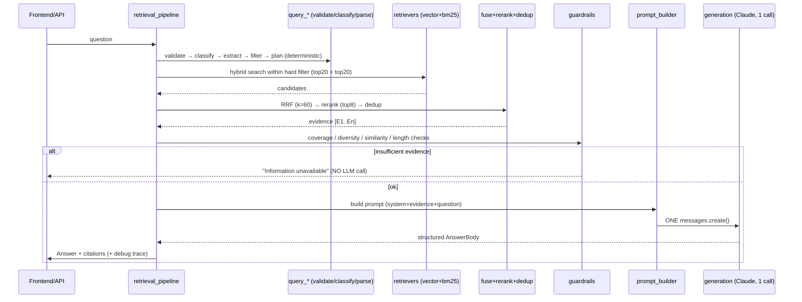
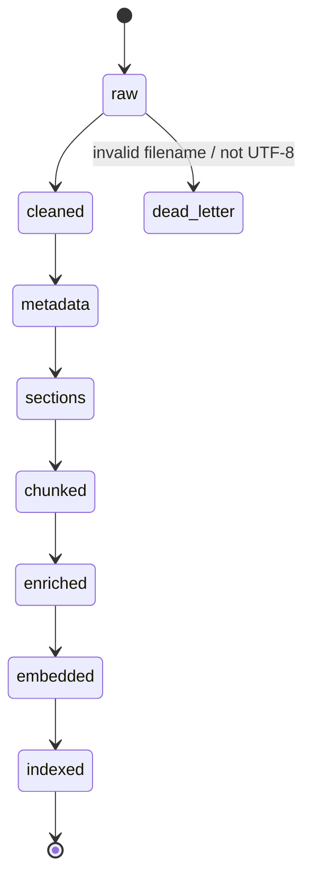
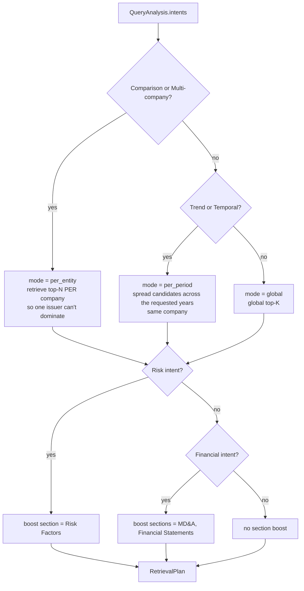
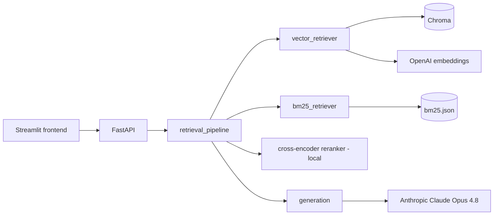

# Retrieval & Generation — Technical Design Specification (Phase 2)

Implementation-grade spec for the query-time layer. This is the **Behavioral + Operational** view
that turns the HLD into a document a developer (or Claude Code) can build with near-zero ambiguity.

It **references, does not duplicate**, the existing docs:
[`ARCHITECTURE.md`](ARCHITECTURE.md) (business/why) · [`HLD.md`](HLD.md) (logical) ·
[`PHYSICAL_SPEC.md`](PHYSICAL_SPEC.md) (storage schema, RRF formula, prompt template, output/citation/
confidence schema, log taxonomy) · [`ASSUMPTIONS.md`](ASSUMPTIONS.md) · [`ADR.md`](ADR.md) (decision records).

---

## 0. Non-negotiable constraint

> **The final answer is produced in exactly ONE LLM API call.** Everything before it is
> **deterministic or local ML**. No agentic retrieval, no LLM query rewriting, no HyDE, no
> decomposition, no self-reflection, no planning agents.

The retrieval layer's job is to hand the model the **smallest set of highly relevant, trustworthy
evidence**; the model only reasons over curated evidence — it never searches the corpus.

---

## 1. Retrieval philosophy

```
Question → Query Understanding → Retrieval Planning → Hybrid Search → Reranking
        → Evidence Builder → Guardrails → Prompt Builder → ONE LLM CALL → Grounded Answer
```

Everything left of "ONE LLM CALL" is deterministic. That is the production mindset we are defending.

---

## 2. Pipeline stages (query time)

| # | Stage | Module (`src/`) | LLM? |
|---|-------|-----------------|------|
| 1 | Query validation | `retrieval/query_validator.py` | no |
| 2 | Query understanding (classification) | `retrieval/query_classifier.py` | no |
| 3 | Metadata extraction | `retrieval/metadata_parser.py` | no |
| 4 | Hard-filter construction | `retrieval/metadata_filter.py` | no |
| 5 | Retrieval planning | `retrieval/retrieval_planner.py` | no |
| 6 | Hybrid search (vector + BM25) | `retrieval/vector_retriever.py`, `bm25_retriever.py` | no |
| 7 | Reciprocal Rank Fusion | `retrieval/hybrid_fusion.py` | no |
| 8 | Cross-encoder reranking | `retrieval/reranker.py` | local ML |
| 9 | Deduplication | `retrieval/deduplicator.py` | no |
| 10–11 | Context builder + evidence grounding | `retrieval/evidence_builder.py` | no |
| 12 | Guardrails | `retrieval/guardrails.py` | no |
| 13 | Prompt builder | `retrieval/prompt_builder.py` | no |
| 14 | **Single LLM call** | `generation/generate.py` | **YES (the one)** |
| 15–16 | Response parse + citation mapping | `retrieval/response_parser.py`, `citation_mapper.py` | no |
| — | Orchestrator | `retrieval/retrieval_pipeline.py` | — |
| 17 | Query logging | `retrieval/retrieval_pipeline.py` + `observability` | no |
| 18 | Debug UI | `frontend/app.py` | no |

---

## 3. Data contracts (input → output per stage)

Contracts are **executable pydantic models** in `src/schemas.py` (`extra="forbid"`, typed, required
vs optional). This table is the index; the model is the source of truth.

| Stage | Input | Output (model) | Key fields |
|-------|-------|----------------|------------|
| Validation | `str` | `str` (or raises `QueryError`) | — |
| Classification | `str` | `QueryAnalysis.intents` | `intents: list[str]` (multi-label) |
| Metadata extract | `str` | `QueryAnalysis` | `companies[], years[], quarters[], forms[], section_intent[], intents[]` |
| Filter build | `QueryAnalysis` | `HardFilter` | `where: dict` (Chroma), `predicate` (BM25) |
| Planning | `QueryAnalysis` | `RetrievalPlan` | `mode`, `per_entity_k`, `section_boosts`, `pool_size` |
| Hybrid search | `HardFilter, RetrievalPlan` | `list[RetrievalResult]` ×2 | `chunk, score, rank` |
| RRF | 2× ranked lists | `list[RetrievalResult]` | fused `score` |
| Rerank | query + candidates | `list[RetrievalResult]` | cross-encoder `score`, top-`rerank_top_k` |
| Dedup | `list[RetrievalResult]` | `list[RetrievalResult]` | diversity-preserving |
| Evidence build | `list[RetrievalResult]` | `list[Evidence]` | `evidence_id [E1..], chunk, tag` |
| Guardrails | `QueryAnalysis, list[Evidence]` | `GuardrailResult` | `ok, action, reason` |
| Prompt build | `QueryAnalysis, list[Evidence]` | `PromptBundle` | `system, user, prompt_version` |
| **LLM call** | `PromptBundle` | `AnswerBody` (structured) | `executive_summary, comparison, supporting_evidence, citations, confidence, limitations` |
| Parse + cite | `AnswerBody, list[Evidence]` | `Answer` | `answer, sources[Citation], retrieved[], usage` |

New Phase-2 models to add (P2): `QueryAnalysis`, `HardFilter`, `RetrievalPlan`, `Evidence`,
`GuardrailResult`, `PromptBundle`, `AnswerBody`. Existing `Citation`/`RetrievalResult`/`Answer` are reused.

---

## 4. Sequence diagram



---

## 5. Ingestion state machine (offline, built in Phase 1)



Each transition persists an inspectable artifact under `data/<state>/`; each is idempotent (re-runs
skip current stages, upsert by id). A per-doc failure is dead-lettered, never aborting the batch.

---

## 6. Retrieval decision tree (Stage 5 planning)



Boosts are applied as soft rank adjustments within the hard-filtered set — they never override a hard
metadata filter.

---

## 7. Configuration table (`src/config.py`)

Bounds are enforced with pydantic `Field(ge=, le=)` (P2).

| Parameter | Default | Min | Max | Why |
|-----------|---------|-----|-----|-----|
| `chunk_max_chars` | 3000 | 600 | 6000 | max cap; big enough for a table + narrative, small enough to rank precisely |
| `chunk_overlap` | 300 | 0 | 1000 | ~10% cross-boundary context; must be < cap |
| `vector_top_k` | 20 | 5 | 100 | recall pool from ANN before fusion |
| `bm25_top_k` | 20 | 5 | 100 | recall pool from lexical before fusion |
| `rrf_k` | 60 | 1 | 1000 | RRF constant; 60 is the standard default |
| `rerank_top_k` | 8 | 1 | 20 | final evidence count into the prompt |
| `candidate_pool` | 30 | 5 | 200 | fused pool size handed to the reranker |
| `min_similarity` | 0.35 | 0.0 | 1.0 | below this a candidate is treated as non-evidence |
| `max_query_chars` | 1000 | 50 | 4000 | reject pathological queries |
| `min_query_chars` | 3 | 1 | 50 | reject empty/one-char queries |
| `rerank_model` | `BAAI/bge-reranker-base` | — | — | local cross-encoder; `-large` if latency budget allows |
| `generation_model` | `claude-opus-4-8` | — | — | the single grounded call ([ADR-005](ADR.md)) |
| `embedding_model` | `text-embedding-3-large` | — | — | query + corpus embeddings ([ADR-004](ADR.md)) |
| `embed_batch_size` | 100 | 1 | 2048 | chunks per OpenAI request |
| `embed_max_retries` | 3 | 0 | 10 | backoff on 429/5xx |

---

## 8. Guardrail decision table (Stage 12 — deterministic, no LLM)

| Guardrail | Condition | Action |
|-----------|-----------|--------|
| Empty / malformed | fails validation (§Stage 1) | **reject** before retrieval |
| Min similarity | top evidence sim `< 0.35` | **reject** → "Information unavailable" |
| Weak evidence band | best sim `0.35–0.50` | **warn** → answer, flag Low confidence |
| Strong evidence | best sim `> 0.50` | **accept** |
| Company coverage | a requested company has **0** retrieved chunks | **reject** for that entity → say which is missing |
| Temporal coverage | a requested year has 0 chunks | **warn** → answer over available years, state the gap |
| Comparison diversity | comparison query but evidence covers `< 2` companies | **reject** → "insufficient evidence to compare" |
| Duplicate evidence | same doc+section+content_hash | **drop** duplicate (Stage 9) |
| Context length | prompt would exceed the token budget (§10) | **trim** lowest-ranked evidence until it fits |

The golden rule: **never answer outside retrieved evidence**; when in doubt, refuse. The refusal path
short-circuits **before** the LLM call (still zero or one call — here zero).

---

## 9. Failure / fallback matrix

| Component | Failure | Fallback | Where |
|-----------|---------|----------|-------|
| Query embedding (OpenAI) | timeout / 5xx | SDK retry ×3 backoff → then **BM25-only** retrieval | P8/P17 |
| Vector search (Chroma) | store error | **BM25-only** | P8/P17 |
| BM25 index | missing/error | **vector-only** | P8/P17 |
| Both retrievers | both fail | refuse ("retrieval unavailable"), no LLM call | P17 |
| Reranker (cross-encoder) | model not installed / error | **skip reranking**, keep RRF order | P10 |
| Guardrail refusal | insufficient/weak evidence | return refusal, **no LLM call** | P13/P17 |
| LLM call (Claude) | 429/5xx | SDK auto-retry with backoff; still **one logical call** | P15 |
| LLM call | hard failure after retries | return error envelope, log, no partial hallucination | P15/P17 |
| Metadata extract | ambiguous/no match | proceed with **no hard filter** (soft retrieval over all) | P6/P17 |

Degradation is always toward *fewer guarantees but a grounded answer or an honest refusal* — never
toward fabrication.

---

## 10. Performance & token budgets

**Latency targets** (single query, warm; honest CPU estimates — the query embedding and the LLM call
dominate, everything else is sub-100ms):

| Stage | Target |
|-------|--------|
| Validation + classification + metadata + planning | < 10 ms (pure Python) |
| BM25 search | < 20 ms |
| Query embedding (OpenAI, network) | ~150–300 ms |
| Vector ANN search (Chroma) | < 40 ms |
| RRF + dedup | < 5 ms |
| Cross-encoder rerank (base, CPU, ~30 pairs) | ~150–500 ms |
| **Single Claude call (streamed)** | ~2–6 s |
| **End-to-end** | **< ~8 s** |

**Token budget** (Opus 4.8 has a 1M context, so this is about *precision & cost*, not fitting):

| Segment | Budget |
|---------|--------|
| System prompt | ~400 tokens |
| Instructions + output format | ~300 |
| Evidence (8 × ~800) | ~6,400 |
| Question | ~200 |
| **Input total** | **~7.3K** |
| Output cap (`max_tokens`) | ~1,500 |

The prompt builder (P14) enforces the input budget by trimming lowest-ranked evidence first.

---

## 11. Dependency graph



---

## 12. LangChain module map (infrastructure only — [ADR-011](ADR.md))

**Use LangChain for:** `langchain_openai.OpenAIEmbeddings` (query + corpus), `langchain_chroma.Chroma`
vector retriever, `langchain_core.documents.Document`, `langchain_core.prompts.PromptTemplate`,
structured **output parser**, `langchain_anthropic.ChatAnthropic` for the single call via
`.with_structured_output()`, and usage **callbacks** for token counting.

**Do NOT use LangChain for:** query understanding, metadata extraction, retrieval planning, RRF,
guardrails, context/evidence builder, citation mapping. **No Chains. No Agents. No memory.** Those are
our own deterministic modules so every decision is controllable and defensible.

---

## 13. API specification (`src/api/main.py`, FastAPI — P19)

FastAPI auto-publishes OpenAPI/Swagger at `/docs`. Contract:

```
POST /query
  body:   { "question": str, "debug": bool = false }
  200:    { "answer": str, "sections": AnswerBody, "citations": [Citation],
            "confidence": "High|Medium|Low", "usage": {tokens,cost_usd,latency_s},
            "trace": StageTrace | null }        # trace present only when debug=true
  422:    validation error (empty/too long)
  200 (refusal): { "answer": "Information unavailable in the provided filings.", ... }
  500:    { "error": str }                       # retrieval/LLM hard failure

GET /health → { "status": "ok", "chroma": bool, "bm25": bool, "chunks": int }
```

---

## 14. Observability metrics (Stage 17 logging → `data/logs/queries/`)

Per query: question · intents · extracted metadata · hard filter · BM25 ids · vector ids · RRF ids ·
reranked ids · final evidence ids · prompt (+ `prompt_version`) · response · **latency breakdown** ·
embedding tokens · input/output tokens · **cost_usd** (Claude $5/$25 per 1M in/out) · guardrail action.

Quality metrics (Stage 21 eval): recall@k, precision@k, MRR, **NDCG**, groundedness, **citation
coverage** (fraction of claims with a resolvable `[E#]`).

---

## 15. Security

**In scope for the MVP (built):** secrets only via `.env` / env (`SecretStr`, git-ignored, never in
logs or reprs); the query log stores prompts/responses but **no API keys**; input validation caps
query size (basic abuse guard); OpenAI/Anthropic keys isolated to the point of use (`require_*`).

**Documented as roadmap, not built** (gold-plating for a single-user, public-data demo): request rate
limiting, PII detection/scrubbing, per-tenant auth, secrets vault. SEC filings are public, so there is
no confidential corpus to protect; the honest engineering call is to note these and not build them now.

---

## 16. Testing strategy

| Level | What | Where |
|-------|------|-------|
| Unit | each stage module in isolation (deterministic inputs) | `tests/test_<stage>.py` |
| Integration | retrievers against a small local Chroma + bm25 fixture | `tests/test_retrieval_*.py` |
| Pipeline | full `retrieval_pipeline` with a **fake generator** (no network) incl. refusal path | `tests/test_pipeline.py` |
| Golden queries | curated question → expected companies/sections retrieved | `src/eval/eval_set.jsonl` |
| Regression | eval metrics tracked over changes; alert on drop | `src/eval/` |

The one LLM call is always mocked in tests via the `Generator` protocol; real calls are exercised only
in manual/demo runs with a key.

---

## 17. Production roadmap

| Stage | Scope |
|-------|-------|
| **MVP (this build)** | deterministic retrieval + one grounded Claude call + citations + debug UI + eval harness; local Chroma/BM25; single user |
| **Pilot** | real embed/store run on full corpus; rate limiting + auth on the API; cached query results; prompt-version A/B via the log |
| **Production** | managed vector store (or Chroma server), autoscaling API, monitoring/alerting dashboards, cost budgets, incremental re-index on new filings (already supported by `raw_index.json`) |
| **Enterprise** | multi-tenant, PII/compliance controls, secrets vault, SLA/latency SLOs, human-in-the-loop eval |

---

## 18. Glossary

| Term | Meaning |
|------|---------|
| **Chunk** | a retrieval-sized piece of one section (max-cap, boundary-preserving) |
| **Section** | a detected SEC item (Business, Risk Factors, MD&A, …); the semantic parent of chunks |
| **Evidence** | a retrieved chunk tagged with an `[E#]` id for the prompt & citations |
| **Grounding** | requiring every answer claim to trace to supplied evidence |
| **Hybrid retrieval** | BM25 (lexical) + vector (semantic), fused |
| **RRF** | Reciprocal Rank Fusion, `Σ 1/(k+rank)`, `k=60` |
| **Candidate pool** | fused set handed to the reranker before top-k selection |
| **Context** | the evidence package assembled into the prompt |
| **Hard filter** | exact metadata constraint applied before ranking (company/year/quarter/form) |
| **Soft retrieval** | relevance ranking (BM25 + vector) within the hard-filtered set |
| **Cite-or-refuse** | answer with citations, or explicitly decline when evidence is insufficient |

---

## Appendix A — Phase 2 commit plan

Small, independently testable commits (behavioral specs from §8/§9 are baked into the code commit
where they take effect, not written as prose-only).

| # | Commit | Adds |
|---|--------|------|
| **P1** | design: this TDS | `RETRIEVAL_DESIGN.md` |
| **P1b** | design: ADRs | `ADR.md` |
| **P2** | retrieval scaffold + config + schemas | `src/retrieval/__init__.py`; config §7 (with `Field` bounds); models §3 |
| **P3** | query validation | `query_validator.py` (§Stage 1) |
| **P4** | query classifier | `query_classifier.py` (multi-label §Stage 2) |
| **P5** | metadata extraction + company dict | `metadata_parser.py`, company aliases in `reference.py` |
| **P6** | hard-filter construction | `metadata_filter.py` (§4 hard/soft) |
| **P7** | retrieval planning | `retrieval_planner.py` (decision tree §6) |
| **P8** | hybrid vector + BM25 (with fallbacks §9) | `vector_retriever.py`, `bm25_retriever.py` |
| **P9** | RRF | `hybrid_fusion.py` (`k=60`, no normalization) |
| **P10** | cross-encoder reranking (skip-on-fail §9) | `reranker.py` (protocol + local + fallback) |
| **P11** | deduplication | `deduplicator.py` |
| **P12** | context builder + evidence grounding | `evidence_builder.py` (`[E#]`) |
| **P13** | guardrails (decision table §8) | `guardrails.py` |
| **P14** | prompt builder (+ token budget §10, `prompt_version`) | `prompt_builder.py` |
| **P15** | single Claude call | `generation/generate.py` (`Generator` protocol, one call) |
| **P16** | response parser + citation mapping | `response_parser.py`, `citation_mapper.py` |
| **P17** | pipeline orchestrator (fallbacks §9) | `retrieval_pipeline.py` |
| **P18** | query logging + debug trace (§14) | logging into pipeline + `data/logs/queries/` |
| **P19** | FastAPI service (§13) | `api/main.py` |
| **P20** | Streamlit debug UI (§Stage 18) | `frontend/app.py` |
| **P21** | eval harness (recall@k/MRR/NDCG/citation-coverage) | `src/eval/` |
| **P22** | docs finalize | refresh `PHYSICAL_SPEC`/`ARCHITECTURE`/`README`/`DESIGN_AUDIT` |
| **P23** | (optional) deployment | `Dockerfile`, `.env.example`, run scripts |
